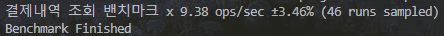
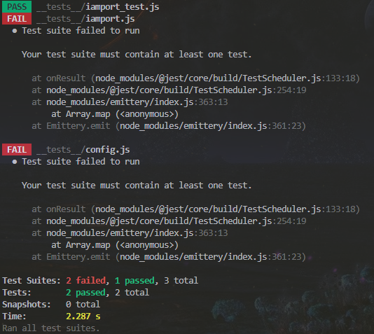

# Nodejs Iamport 연동 

위 레포지터리는 Iamport 연동에 있어서 보다 쉽게 이해하고 연동할 수 있도록 도움을 주는 레포지터리입니다. 별도에 npm, yarm 패키지로 존재하지 않으며, 본인 프로젝트에 파일을 삽입하거나 참고하여 적용할 수 있습니다.

# Function

**_getToken() - private method** : 아임포트에 엑세스 할 수 있는 토큰을 생성합니다. 매 API 호출마다 토큰을 호출하는 이유는
1. 보안 강화: 결제 모듈이기에 단순히 성능점 이점보다는 매번 생성하여  제 3자의 악용을 제어하고, 피해를 최소화 할 수 있습니다.
2. 보안 갱신: 유출에 의한 위험을 최소화합니다.
3. 인증 무결성 :토큰을 자주 갱신시킴으로써, 클라이언트와 서버 간의 인증 무결성을 유지할 수 있습니다. 새로운 토큰을 생성함으로써, 이전에 발급된 토큰을 사용한 악의적인 요청을 방지할 수 있습니다.

**lookupPayment(imp_uid)** : 실제 아임포트 서버내에 해당 결제내역과 결제금액을 확인합니다. 이는 클라이언트에서 스크립트 조작으로 인한 피해에서 비정상적인 결제를 확인할 수 있습니다.

**cancelPayment(imp_uid,opts)** :  환불을 진행하는 함수입니다. 환불 성공여부와 실패한 경우, 환불 금액보다 높은 요구의 환불을 진행한 것인지, 단순히 스크립트 오류로인한 중복환불이 된 것인지 까지 확인할 수 있습니다. (부분환불, 전체환불 모두 진행가능하나, 결제금액 이상의 환불은 불가능합니다.)

**accountConfirm(bankCode, bankAccount)** : 유저의 은행코드와 계좌를 확인하여, 해당 유저가 조회하는 계좌의 소유주인지 확인할 수 있습니다.

**bankCode(bank)** : 아임포트는 은행명이 아닌 은행 코드를 사용하기 때문에 해당 은행명을 통해 은행코드를 얻을 수 있는 함수입니다.

## BenchMark
사실 해당 레포지터리의 밴치마크는 Iamport의 서버 상황에 따라 달라지기 때문에 큰 의미는 없습니다. 다만 평균적으로 

1초에 약 9.38번의 작업을 수행할 수 있습니다. 하지만 이는 매우 최소단위의 실행결과이며, 이에 대한 밴치마크를 확실히하고 싶다면 수천~ 수십만번의 밴치마크가 필요합니다.

## TestCase
이 레포지터리는 실제 testcase를 통해 검증된 레포지터리이며, 아래 failed는 해당 __test__파일에 test file외 test suite가 없는 의미없는 failed일 뿐 시나리오에 대한 test는 모두 통과되었음을 확인할 수 있습니다.

